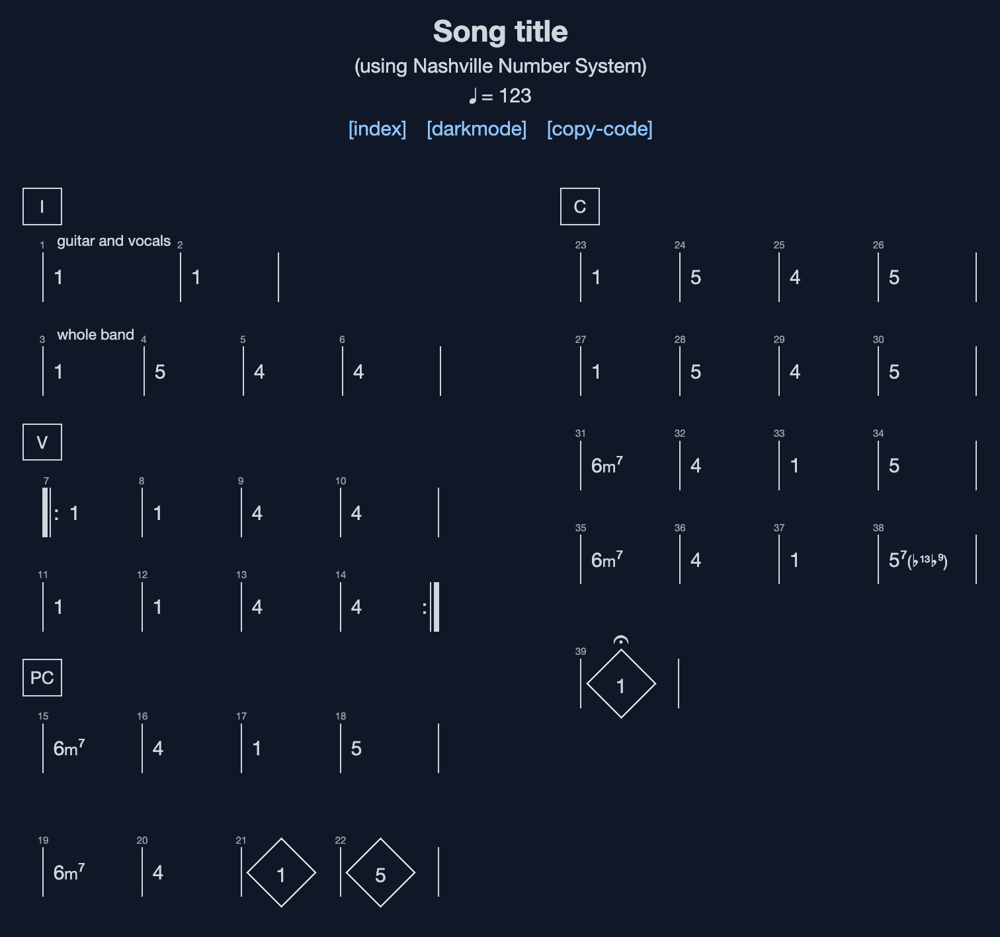
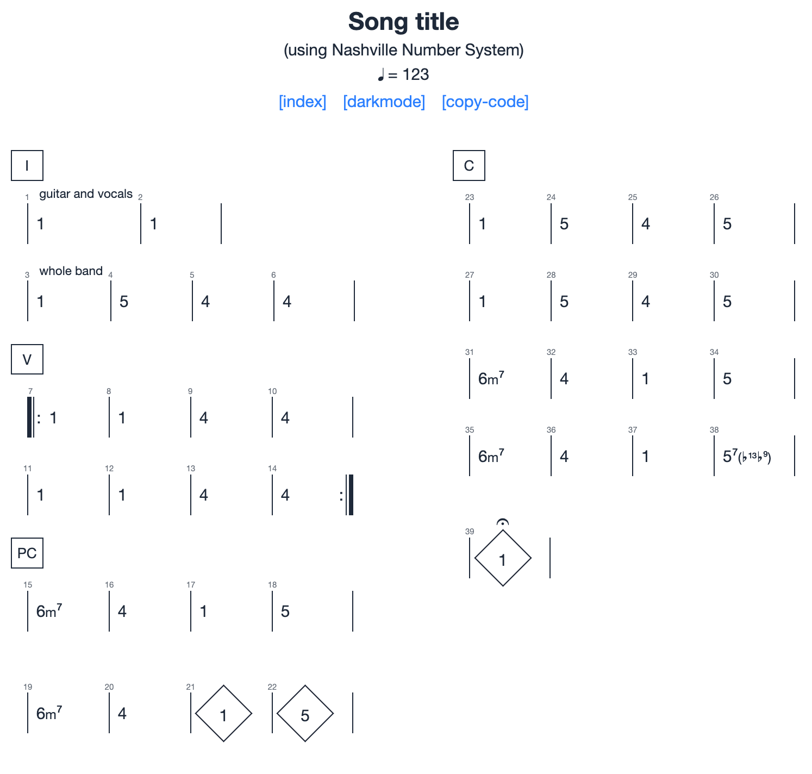
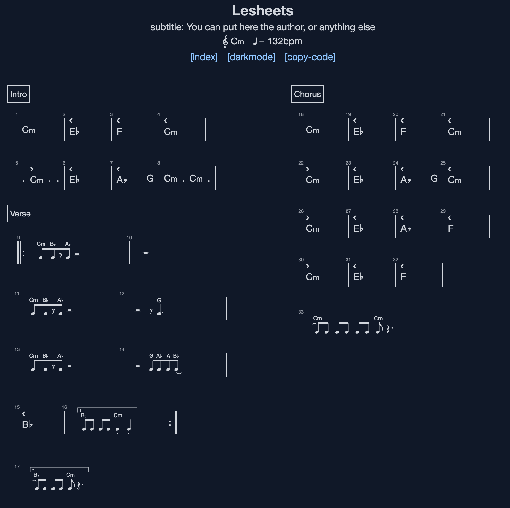
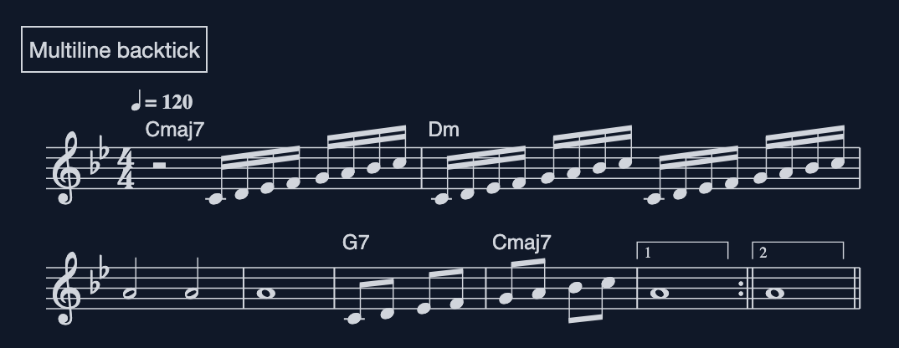
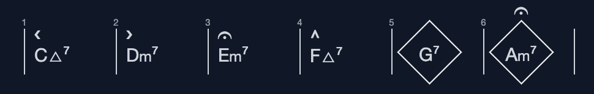
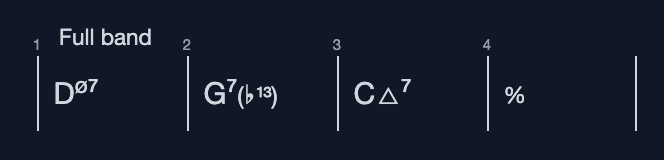
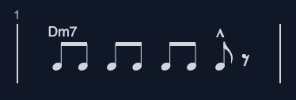
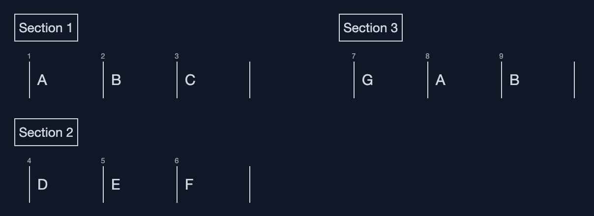

# Lesheets: Create beautiful Chord Charts from a simple, intuitive and easy to write DSL

## Introduction

Lesheets is a tool designed for musicians and band leaders who want to create beautiful
chord charts from simple plain text using Jazz notation or the Nashville Number System. Whether
you're composing music, making arrangements, or just need to share your song ideas with your band,
Lesheets makes it easy to produce professional-looking chord charts in minutes.

## Table of contents
<!-- mtoc-start -->

* [Examples](#examples)
  * [Nashville number system](#nashville-number-system)
  * [Jazz chords and rhythm](#jazz-chords-and-rhythm)
  * [Multiline backtick](#multiline-backtick)
* [Key Features](#key-features)
* [Quick Start](#quick-start)
  * [Installation](#installation)
* [Syntax](#syntax)
* [Aknowledgments](#aknowledgments)

<!-- mtoc-end -->

## Examples

### Nashville number system

Input:
```markdown
---
title: Advanced with ABC music notation for rhythm
subtitle: "embedding ABC in backticks ``"
tempo: 123
Key: C#m
---

# I
"guitar and vocals"
1 | 1
"whole band"
1 | 5 | 4 |4

# V
||: 1 | 1 | 4 |4
1 | 1 | 4 |4 :||

# PC
6m7 | 4 | 1 |5
6m7 | 4 | !diamond!1 |!diamond!5

#- C
1 | 5 | 4 |5
1 | 5 | 4 |5

6m7 | 4 | 1 |5
6m7 | 4 | 1 |57(b13b9)
!diamond-fermata!1
```

Output:




### Jazz chords and rhythm

Input:
```markdown
---
title: Lesheets
subtitle: "subtitle: You can put here the author, or anything else"
tempo: 132bpm
key: Cm
columns: 2
---
# Intro

Cm | !push!Eb | !push!F | !push!Cm |
. !pull!Cm . . | !push!Eb | !push!Ab G | Cm . !choke!Cm . |

# Verse

||: `"Cm" F2"Bb"F2z2"Ab"F2 z8` | `z16` |
`"Cm" F2"Bb"F2z2"Ab"F2 z8` | `z8 z2"G"F6` |
`"Cm" F2"Bb"F2z2"Ab"F2 z8` | `z8 "G"F2"Ab"F2"A"F2("Bb"F2` |
!push!Bb | `[1"Bb"F2F2 F2F2 "Cm".F4.F4  ]` :||
`[2"Bb"F2)F2 F2F2 "Cm"F2 z6` |

#- Chorus

Cm | !push!Eb | !push!F |!push!Cm |
!pull!Cm | !push!Eb | !push!Ab G | !push!Cm |
!pull!Cm | !push!Eb | !push!Ab | !push!F |
!pull!Cm | !push!Eb | !push!F |
`"Cm"F2)F2 F2F2 F2F2 "Cm"F2 z6` |
```

Output:


### Multiline backtick

Input:

````markdown
# Multiline backtick

```
X:1
M:4/4
K:Bb
Q:1/4=120
L:1/16
"Cmaj7"z8 CDEF GABc | "Dm"CDEF GABc CDEF GABc |
A8 A8 |A16| "G7"C2D2 E2F2 |"Cmaj7" G2A2 B2c2 |[1 A16] :|| [2 A16] ||
```

````

Output:




## Key Features

- **Easy-to-Use DSL (Domain Specific Language):** Write your songs using a simple and intuitive syntax inspired by markdown and ABC.
- **Jazz Notation & [Nashville Number System](https://en.wikipedia.org/wiki/Nashville_Number_System):** Support for two of the most popular chord notation systems.
- **Add Rhythm notation using [ABC music notation](https://abcnotation.com/wiki/abc:standard) via backtick notation:** Add rhythm figures inline for the unison parts using a subset of [ABC music notation](https://abcnotation.com/wiki/abc:standard).
- **Full ABC notation via multiline backtick:**:
  ````text
  ```
  <abc code here>
  ```
  ````
- **Dark and light mode**. Of course.
- **Beautiful Chord Charts:** Export your charts as HTML, PDF.
- **Live preview editor:** Write your charts instantly previewing the end result. Save and open your
  charts to/from your computer. Print to paper or PDF for easy sharing with your band mates.

## Quick Start

Go to [the online editor](https://lesheets.jtorr.eu/editor.html) and start writing your charts.

### Installation

To get started with Lesheets, follow these simple steps:

```bash
git clone https://github.com/jjtorroglosa/lesheets
cd lesheets
make dev
```

## Syntax

* Header:
  ```text
  ---
  title: The title
  subtitle: the subtitle
  tempo: 123bpm
  key: C
  L: 1/8
  ---
  ```
  `L: 1/8` sets the default note length in inline backticks. So `AA` are two eigth notes.
* Chords and bars: `Cmaj7 | Dmin7`
* Chords annotations: `!push!Cmaj7 | !pull!Dmin7 | !fermata!Emin7 | !marcato!Fmaj7 | !diamond!G7 | !diamond-fermata!Amin7`
  
* Repetitions: `||: D | E :||`
* Bar notes: `"Full band" Dhalfdim7 | G7(b13) | Cmaj7 | %`:
  
* ABC rhythm: `` `"Dm7"AA AA AA !marcato!Az` ``
  
* ABC multiline: See the [Multiline backtick](#multiline-backtick) example.
* Multi column: `#- Section`
  ```text
  # Section 1
  A | B | C

  # Section 2
  D | E | F

  #- Section 3
  G | A | B
  ```
  

## Aknowledgments

Thanks to the developers behind the following projects for making this project possible:

- [**Abc2svg**](https://chiselapp.com/user/moinejf/repository/abc2svg/doc/trunk/README.md)
- [**Ace Editor**](https://ace.c9.io/)
- [**Tailwind**](https://tailwindcss.com/)
- [**fastschema/qjs**](https://github.com/fastschema/qjs): QJS is a CGO-Free, modern, secure JavaScript runtime for Go applications, built on the powerful QuickJS engine and Wazero WebAssembly runtime.

