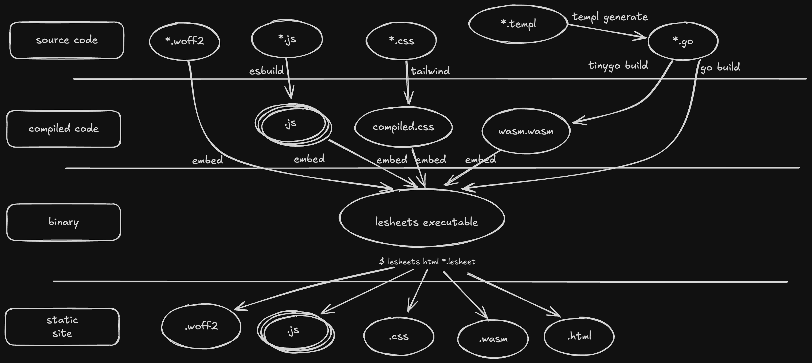

<div align="center">

# Lesheets: Create beautiful Chord Charts from a simple, intuitive and easy to write DSL

Lesheets is a tool designed for musicians and band leaders who want to create beautiful chord charts
from simple plain text using Jazz notation or the Nashville Number System. It allows you to write simple
chord charts, or include detailed traditional music notation with
[ABC syntax](https://abcnotation.com/wiki/abc:standard) for the parts that you need more detail.

Whether you're composing music, making arrangements, or just need to share your song ideas with your band,
Lesheets makes it easy to produce professional-looking chord charts in minutes.

</div>

## Table of contents
<!-- mtoc-start -->

* [Examples](#examples)
  * [Nashville number system](#nashville-number-system)
  * [Jazz chords and rhythm](#jazz-chords-and-rhythm)
  * [Multiline backtick](#multiline-backtick)
* [Key Features](#key-features)
* [Quick Start](#quick-start)
  * [Installation](#installation)
  * [Command line interface](#command-line-interface)
* [Syntax](#syntax)
* [Architecture](#architecture)
* [Acknowledgments](#acknowledgments)

<!-- mtoc-end -->

## Examples

### Nashville number system

Input ([lesheets-nashville](./docs/lesheets/lesheets-nashville.lesheet)):

```markdown
---
title: Song title
subtitle: (using Nashville Number System)
tempo: 123
Key: C#m
---

# I
"guitar and vocals"
1 | 1
"whole band"
1 | 5 | 4 |4

# V

||: 1 | 1 | 4 | 4
    1 | 1 | 4 | 4 :||

# PC

6m7 | 4 | 1 | 5
6m7 | 4 | !diamond!1 |!diamond!5

#- C

1 | 5 | 4 |5
1 | 5 | 4 |5

6m7 | 4 | 1 |5
6m7 | 4 | 1 |57(b13b9)
!diamond-fermata!1
```

Output:


### Jazz chords and rhythm

Input ([lesheets-multiline-backtick](./docs/lesheets/lesheets-abc.lesheet)):

```markdown
---
title: Lesheets
subtitle: "subtitle: You can put here the author, or anything else"
tempo: 132bpm
key: Cm
columns: 2
---
# Intro

Cm | !push!Eb | !push!F | !push!Cm |
. !pull!Cm . . | !push!Eb | !push!Ab G | Cm . !marcato!Cm . |

# Verse

||: `"Cm" F2"Bb"F2z2"Ab"F2 z8` | `z16` |
`"Cm" F2"Bb"F2z2"Ab"F2 z8` | `z8 z2"G"F6` |
`"Cm" F2"Bb"F2z2"Ab"F2 z8` | `z8 "G"F2"Ab"F2"A"F2("Bb"F2` |
!push!Bb | `[1"Bb"F2F2 F2F2 "Cm".F4.F4  ]` :||
`[2"Bb"F2)F2 F2F2 "Cm"F2 z6` |

#- Chorus

Cm | !push!Eb | !push!F |!push!Cm |
!pull!Cm | !push!Eb | !push!Ab G | !push!Cm |
!pull!Cm | !push!Eb | !push!Ab | !push!F |
!pull!Cm | !push!Eb | !push!F |
`"Cm"F2)F2 F2F2 F2F2 "Cm"F2 z6` |
```

Output:


### Multiline backtick

Input ([lesheets-multiline-backtick](./docs/lesheets/lesheets-multiline-backtick.lesheet)):


````markdown
# Multiline backtick

```
X:1
M:4/4
K:Bb
Q:1/4=120
L:1/16
"Cmaj7"z8 CDEF GABc | "Dm"CDEF GABc CDEF GABc |
A8 A8 |A16| "G7"C2D2 E2F2 |"Cmaj7" G2A2 B2c2 |[1 A16] :|| [2 A16] ||
```
````

Output:


## Key Features

- **Easy-to-Use DSL (Domain Specific Language):** Write your songs using a simple and intuitive syntax inspired by markdown and ABC.
- **Jazz Notation & [Nashville Number System](https://en.wikipedia.org/wiki/Nashville_Number_System):** Support for two of the most popular chord notation systems.
- **Add rhythm figures using [ABC music notation](https://abcnotation.com/wiki/abc:standard) via
  backtick:** Add rhythm figures inline for the unison parts using a subset of [ABC music
  notation](https://abcnotation.com/wiki/abc:standard).
- **Full ABC notation via multiline backtick:**
  ````text
  ```
  <abc code here>
  ```
  ````
- **Dark and light mode**. Of course.
- **Beautiful Chord Charts:** Export your charts as HTML or PDF using your browser print dialog (this works better in Chrome based browser).
- **Live preview editor:** Write your charts instantly previewing the end result. Save and open your
  charts to/from your computer. Print to paper or PDF for easy sharing with your band mates.

## Quick Start

Go to [the online editor](https://lesheets.jtorr.eu/editor.html) and start writing your charts.

### Installation

If you prefer to work locally with the CLI application:

```bash
git clone https://github.com/jjtorroglosa/lesheets
cd lesheets
make lesheets
./build/lesheets
```

### Command line interface

```
$ lesheets 
Usage: lesheets [options] <command> <file1> ... <fileN>

Commands:
  watch   Watch the input files for changes, rendering the html files for them in outdir dir
  serve   Run a server for the previously generated html files
  html    Render html files for all the files provided as arguments
  json    Print a json representation of the song

Options:
  -d string
    	Output dir (default "output")
  -p int
    	The port for listening to HTTP requests for commands that start an HTTP server (default 8008)
  -print
    	Print song in text format (only available for the html command)
  -print-tokens
    	Print tokens (only available for the html command)
```

## Syntax

* Header:
  ```text
  ---
  title: The title
  subtitle: the subtitle
  tempo: 123bpm
  key: C
  L: 1/8
  ---
  ```
  `L: 1/8` sets the default note length in inline backticks. So `AA` are two 1/8th notes.
* Chords and bars: `Cmaj7 | Dmin7`
* Chords annotations: `!push!Cmaj7 | !pull!Dmin7 | !fermata!Emin7 | !marcato!Fmaj7 | !diamond!G7 | !diamond-fermata!Amin7`
  
* Repetitions: `||: D | E :||`
* Bar notes: `"Full band" Dhalfdim7 | G7(b13) | Cmaj7 | %`:
  
* ABC rhythm: `` `"Dm7"AA AA AA !marcato!Az` ``
  
* ABC multiline: See the [Multiline backtick](#multiline-backtick) example.
* Multi column: `#- Section`
  ```text
  # Section 1
  A | B | C

  # Section 2
  D | E | F

  #- Section 3
  G | A | B
  ```
  

## Architecture

Here's a picture of how the lesheets executable is built:



As you can see, all the assets are embedded in the final lesheets executable. Then, when you run:
```bash
$ lesheets html <your_input_files>
```
the system automatically generates an HTML file for each input song, along with all the necessary
static assets such as JavaScript files, fonts, and CSS. In addition to these individual song pages,
it also creates an editor.html file that provides a live, in-browser song editor.

This editor will use the parsing and rendering logic implemented in go by importing the WebAssembly
(wasm) artifact. This allows to have all the functionality directly within your browser providing an
uninterrupted, offline writing experience.

## Acknowledgments

Thanks to the developers behind the following projects for making this project possible:

- [**Abc2svg**](https://chiselapp.com/user/moinejf/repository/abc2svg/doc/trunk/README.md)
- [**Ace Editor**](https://ace.c9.io/)
- [**Tailwind**](https://tailwindcss.com/)
- [**Templ**](https://templ.guide/): Really nice templating system, but, the best feature is that it's compatible with TinyGo (`html/template` is not [supported by TinyGo](https://tinygo.org/docs/reference/lang-support/stdlib/#htmltemplate) at the moment of writing)
- [**fastschema/qjs**](https://github.com/fastschema/qjs): QJS is a CGO-Free, modern, secure JavaScript runtime for Go applications, built on the powerful QuickJS engine and Wazero WebAssembly runtime.
